# Andrew Harding's Portfolio

My Portfolio site showcases my Coding, Graphic Design and Developer skills to potential employers. This also gives me a site to house all of my work as some jobs that I have applied for ask for only one link, which is a bit problematic when I have four links. This site addresses and solves this problem. Also I can show off my Graphic Design skills which I will be able to bring to and use in my new role.

## Showcase

A deployed live version of my Portfolio website can be found [here](https://andrewh1188.github.io/andrew-harding-portfolio/)

This domain link will allow you to access my live deployed website for my Portfolio. I have created this as part of my job search in order to showcase to employers my skills, as well as to continue coding and keep my new studied skills fresh, problem solve and learn from the challenges along the way to help make me a better Developer. 

My Portfolio site has been designed to be responsive across all platforms. The original designs kept this factor in mind and also encompasses the simple, clean, appealing and effective look and feel. I used my very colourful CV as the influence in colour choice that has been used and to tie this together with my CV creating continuity across my self brand. This is a skill that would be applied in any area of design and also showcases further still the Graphic Design traits that I have many years experience both study and working in.

## Table of Contents
1. [User Experience UX](#user-experience-ux)
    * [User Stories](#user-stories)
    * [As a new / first time user](#new-first-time-user)
    * [Returning Visitor Goals](#returning-visitor-goals)
    * [User Goals](#user-goals)

2. [Construction Planes](#construction-planes)
    * [Strategy](#strategy)
    * [Scope](#scope)
    * [Structure](#structure)
    * [Skeleton](#skeleton)
    * [Surface](#surface)

3. [Design](#design)
    * [Wireframes](#wireframes)
    * [Imagery](#imagery)

4. [Features](#features)
    * [Existing-features](#existing-features)
    * [Future-features](#future-features)

5. [Technologies and Languages Used](#technologies)
    * [Libraries Frameworks and Online Resources Used](#libraries)
    * [Tools](#tools)
    * [Programmes](#programmes)
    * [Other Resources](#other-resources)
    * [Social Media](#social-media)
    * [Portfolio Sites](#portfolio-sites)

6. [Testing](#testing)

7. [Deployment](#deployment)

8. [Credits](#credits)
    * [Content](#content)
    * [Media](#media)
    * [Acknowledgments](#acknowledgments)

## User Experience UX
## User Stories
## As a new / first time user
## Returning Visitor Goals
## User Goals

## Construction Planes
## Strategy
## Scope
## Structure
## Skeleton
## Surface

## Design
As my site is a portfolio with different works and methods of creativity, from Coding through to Photography, I decided to give each a page with the relevant content. It was hard to pick the various images as I have such a large creative portfolio from many years of work.

The original mock designs that I produced in [Adobe InDesign](https://www.adobe.com/uk/products/indesign.html) can be found below:

#### Home / Index page
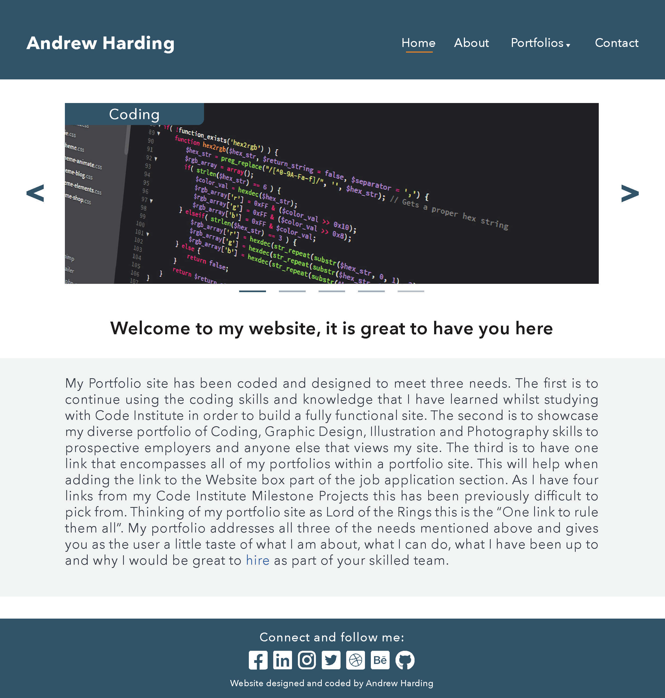

#### About page
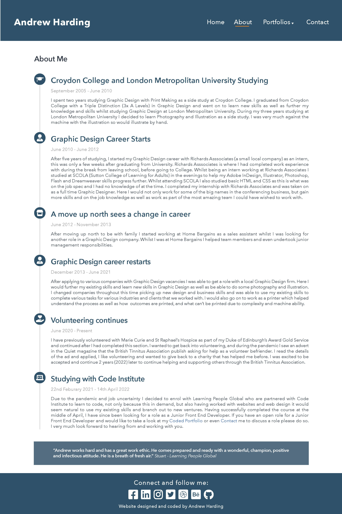

#### Coding page
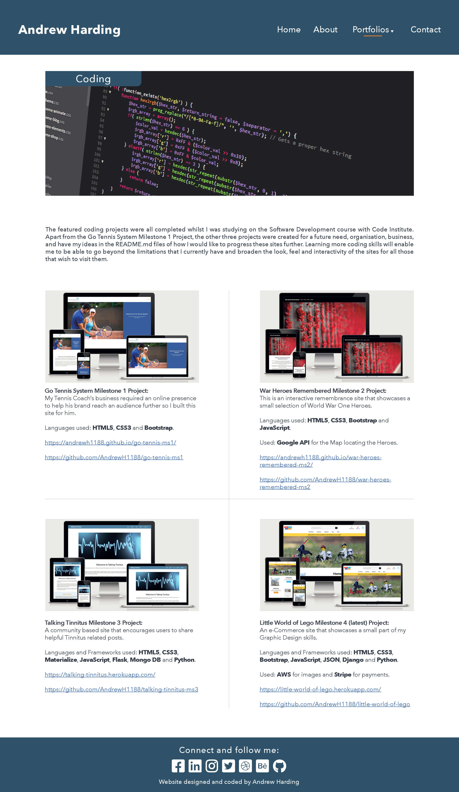

#### Graphic Design page
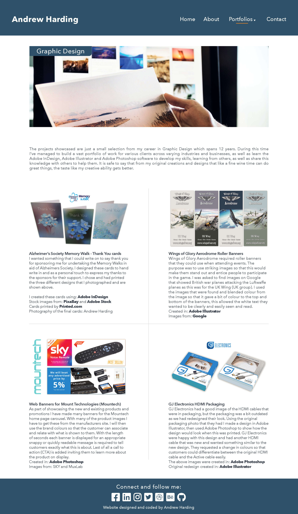

#### Illustration page
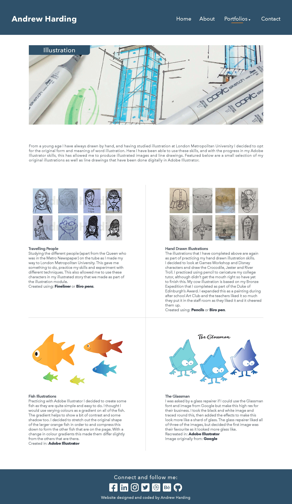

#### Photography page
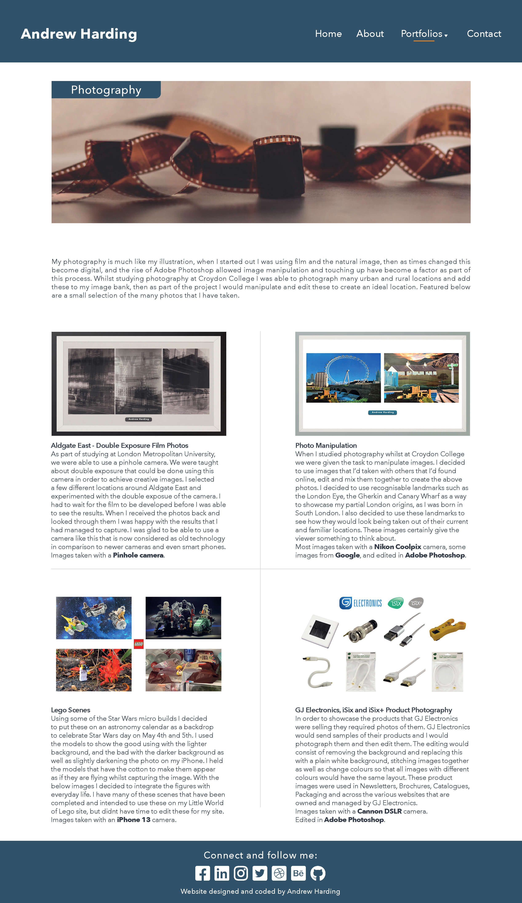

#### Contact page
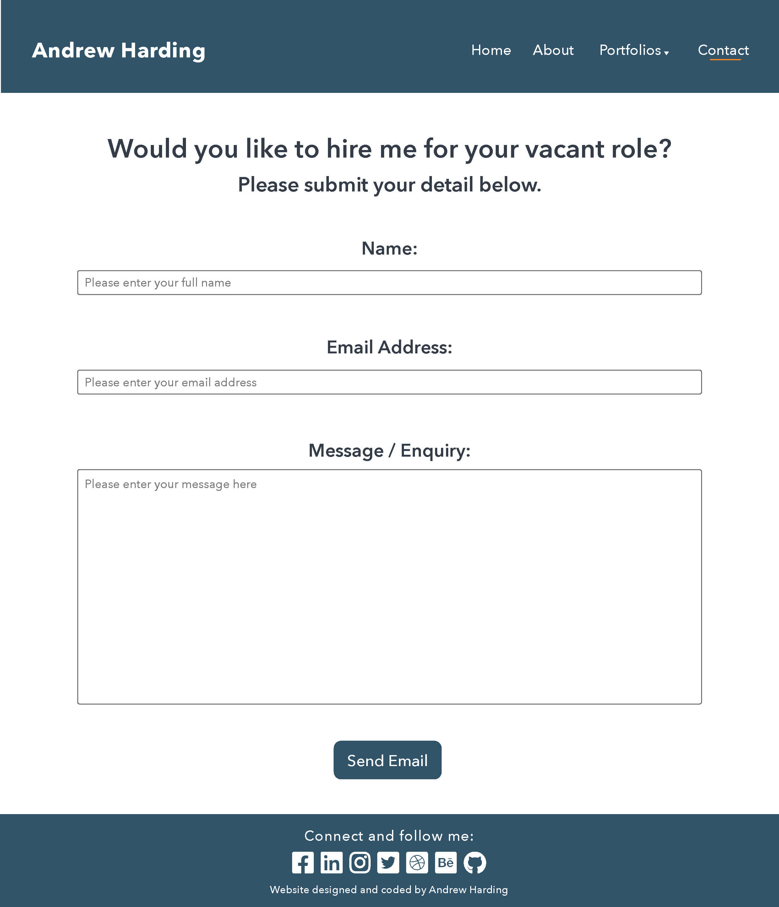

#### 404 Error page
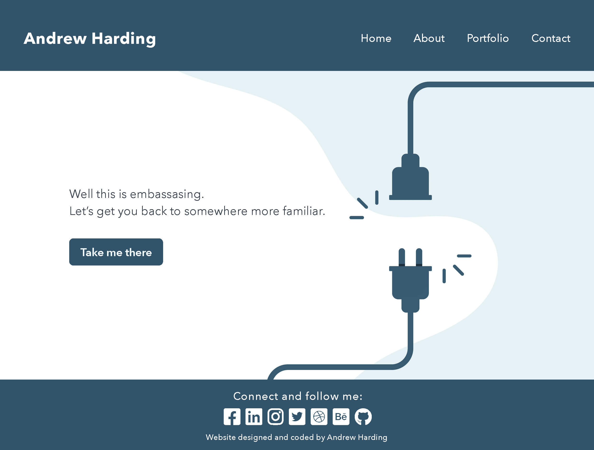

## Wireframes
#### Home / Index page
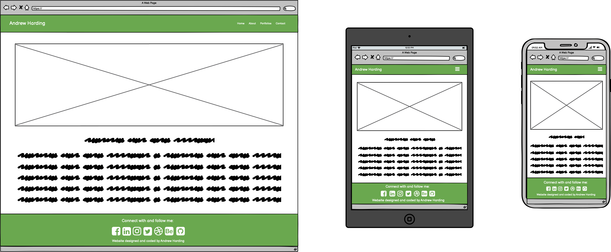

#### About page
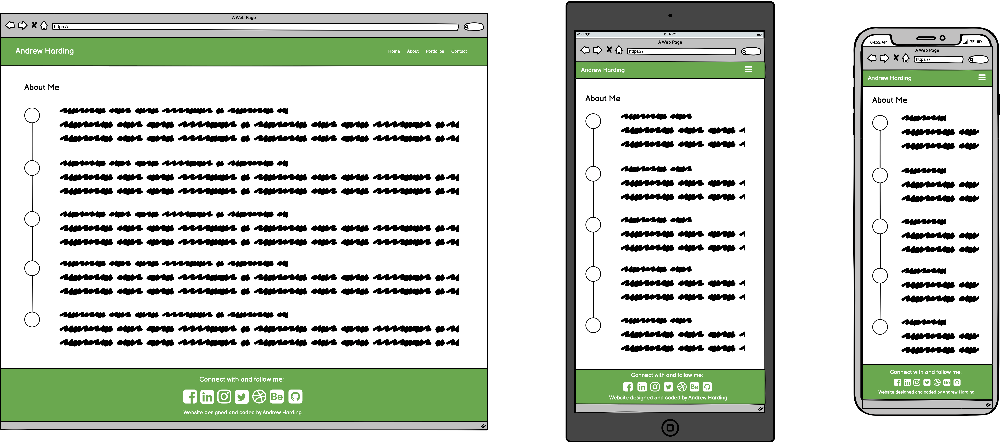

#### All Portfolio pages
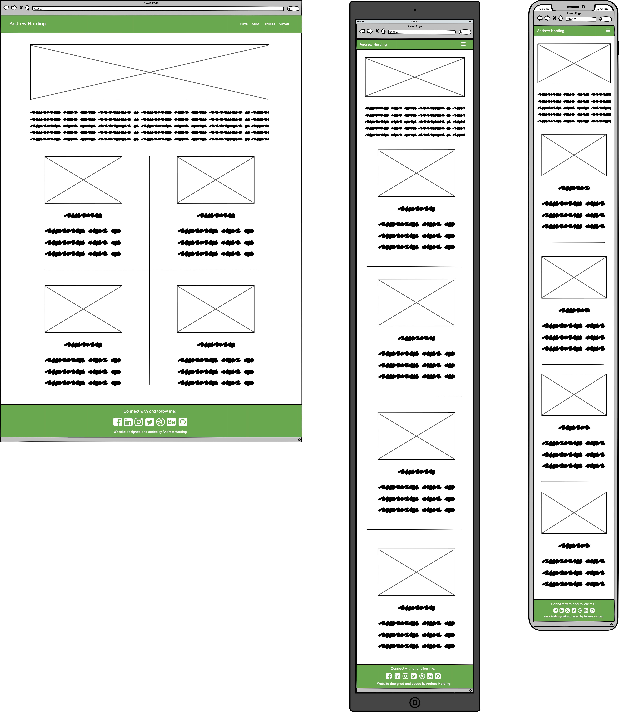

#### Contact page
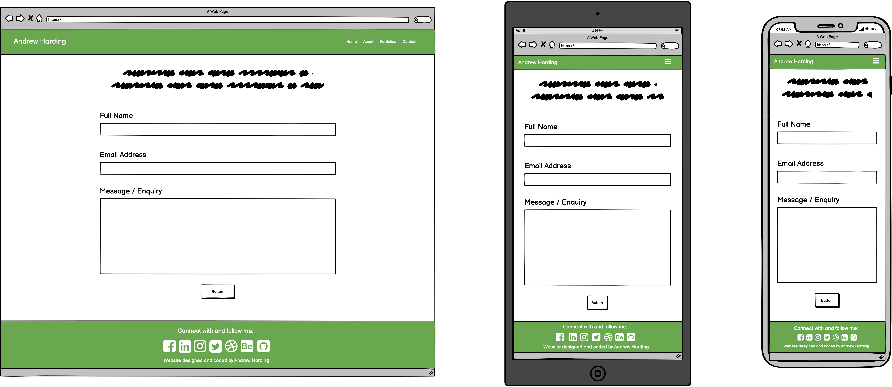

## Imagery
##### Favicon:
I created the favicon that I have used using my initials AH in [Adobe Illustrator](https://www.adobe.com/uk/products/illustrator.html). I then exported this out as a jpg from there and uploaded this for use as part of my site.

##### Coding Carousel image and page banner: 
[Code Coding Web Development Web Developer](https://pixabay.com/photos/code-coding-web-development-944499/)
By lmonk72.
File number: 944499.

##### Graphic Design Carousel image and page banner: 
[Graphic designer drawing sketches logo design.](https://stock.adobe.com/uk/images/graphic-designer-drawing-sketches-logo-design/306445529)
By: REDPIXEL.
File number: 306445529.

##### Illustration Carousel image and page banner: 
[Sketchbook Sketch Marker Felt Tip Pens](https://pixabay.com/photos/sketchbook-sketch-marker-455698/)
By: stux.
File number: 455698.

##### Photography Carousel image and page banner: 
[Multimedia streaming](https://stock.adobe.com/uk/images/multimedia-streaming/36150598)
By: alphaspirit.
File number: 36150598.

##### 404 Error page: 
[Vector illustration 404 error page not found banner. System error, broken page. Disconnected wires from the outlet. Cable and socket. Cord plug. For website. Web Template. Blue. Eps 10](https://stock.adobe.com/uk/images/vector-illustration-404-error-page-not-found-banner-system-error-broken-page-disconnected-wires-from-the-outlet-cable-and-socket-cord-plug-for-website-web-template-blue-eps-10/359092119)
By: accogliente.
File number: 359092119.

Although the Error 404 image was downloaded from [Adobe Stock](https://stock.adobe.com/uk/) I coloured this vector image so this was the same as my site.

## Features
## Existing-features
## Future-features

## Technologies and Languages Used
### Languages
[HTML5](https://en.wikipedia.org/wiki/HTML5)
[CSS3](https://en.wikipedia.org/wiki/CSS)
[JavaScript](https://en.wikipedia.org/wiki/JavaScript)

## Libraries Frameworks and Online Resources Used
* [Google Chrome Dev Tools](https://developer.chrome.com/docs/devtools/): For testing purposes and to see why elements are not working as expected. Dev tools allowed me to make changes to my code in the browser to see a live representation of my website / service with the changes / amends that have been made.
* [Lighthouse](https://developer.chrome.com/docs/lighthouse/overview/): Was used for testing my website / service for Performance, Accessibility, Best Practices and Search Engine Optimisation (SEO). I have tested as before on my portfolio the different categories mentioned above on both mobile applications and computer applications and have loaded the screenshots of the results in the [testing](TESTING.md) section.
* [Google Fonts](https://fonts.google.com/): Google Fonts was used to find a suitable font as well as to import this font into my website / service. The font that I decided to use as it was clean, stylish and fitting is called Spartan which is displayed on all pages on my website / service throughout the project. This is to keep styles consistent throughout my website / service.
* [Font Awesome](https://fontawesome.com/): The Font Awesome Icons that I have used have been listed below:
* [Hamburger Bars icon](https://fontawesome.com/v5/icons/bars?style=solid&s=solid&f=classic)
* [Study icon](https://fontawesome.com/icons/graduation-cap?s=solid&f=classic)
* [Work icon](https://fontawesome.com/icons/user-tie?s=solid&f=classic)
* [Shop icon](https://fontawesome.com/icons/store?s=solid&f=classic)
* [Volunteer icon](https://fontawesome.com/icons/hand-holding-heart?s=solid&f=classic)
* [Facebook icon](https://fontawesome.com/v5/icons/facebook-f?style=brands&s=solid&f=brands)
* [LinkedIn icon](https://fontawesome.com/icons/linkedin?s=&f=brands)
* [Instagram icon](https://fontawesome.com/v5/icons/instagram?style=brands&s=solid&f=brands)
* [Twitter icon](https://fontawesome.com/v5/icons/twitter?style=brands&s=solid&f=brands)
* [Adobe Behance icon](https://fontawesome.com/icons/square-behance?s=&f=brands)
* [GitHub icon](https://fontawesome.com/icons/square-github?s=&f=brands)

* [Tiny PNG](https://tinypng.com/): Again my friend Tiny PNG was used to compress the file size of all images without losing any of the original image quality or distorting the images in any way. This is so that when the pages are loaded the images do not slow down the loading speed and therefore make this user-friendly, as well as reduces the bounce rate of users viewing and clicking off the pages.

* [EmailJS](https://www.emailjs.com/): used in order to hook up my contact section to my email. This is so that I am able to receive, questions or feedback from the users that have interacted with my site / service.

## Tools
* [GitPod](https://www.gitpod.io/) was used to write my code as well as paste in code from Bootstrap. In GitPod I was also able to amend the code from Bootstrap as well as create and style code in both HTML and CSS. I was able to add images to the folders that I created, as well as files to contain the code. In GitPod I was also able to (using python3 -m http.server) view my web page in the browser in a separate tab, allowing me to use the inspect section in Google Dev Tools to inspect elements and see what worked, as well as what didn’t work and amend this accordingly.

* [Git](https://git-scm.com/): Git was used for version control having set up the GitPod Terminal to commit and push saved changes and commits to GitHub.

* [GitHub](https://github.com/): GitHub was used to store the saved changes from my project after being pushed from Git.

* [Balsamiq](https://balsamiq.com/): was used to create the initial wireframes and amend them to reflect the new feature(s)

## Programmes
* [Adobe InDesign](https://www.adobe.com/uk/products/indesign.html) was used to create the design mock up of the site using colours, images, setting the text and layout. I used Adobe InDesign to do this so that I had something that I could use as a final and a visual as to how the final would look. I exported the final design as an Adobe Acrobat PDF so that I could easily view my intended site design. I also exported these designs as jpgs so that these could be stored in the designs file on GitPod and shown in my README.md file.
* [Adobe Illustrator](https://www.adobe.com/uk/products/illustrator.html) was used to create the favicon.
* [Adobe Photoshop](https://www.adobe.com/uk/products/photoshop.html) was used to scale the banner images on the various pages as well as add the text and coloured curved corner boxes for the carousel.

## Other Resources
* [W3C HTML-validator](https://validator.w3.org/): used to find errors in my HTML code as well as implement the suggestions to fix these.
* [Jigsaw](https://jigsaw.w3.org/css-validator/): used to find errors in my CSS code as well as implement the suggestions to fix these.
* [JS Hint](https://jshint.com/): for my JavaScript to see if there are any errors and use the feedback to fix these.
* [Am I Responsive](https://ui.dev/amiresponsive) was used for the screenshot of the mock up which is at the top in my README.md file and also to show off my site my different social media platforms.
Google Chrome Developer Tools was used to test sizes, check responsiveness and view the layouts as well as debug errors and problems I encountered along the way.
* [Prettier.io](https://prettier.io/) was used to make my CSS look neat, tidy and easier to follow / read.
* [Onlinespellcheck.com](https://www.online-spellcheck.com/) I have run my README.md through here to check for any spelling or grammar errors.

## Social Media
With all of my projects I have included the Social Media pages, groups etc and this one is no exception to this rule. I used my own Social Media channels, but have introduced my Adobe Behance and GitHub portfolios into my Portfolio site. I introduced both of these as links so that employers could see previous work in either code or graphic design that I have completed or am working on.
The Social Media channels / pages are all as listed below:
* [Facebook](https://www.facebook.com/AndrewHardingFullStackWebDeveloper)
* [LinkedIn](https://www.linkedin.com/in/andrew-harding-coder)
* [Instagram](https://www.instagram.com/andrewh1188/)
* [Twitter](https://twitter.com/andrewh1188?s=21&t=t6-HtguZVHz7MbNRaVFGiQ)

## Portfolio Sites
This is a new feature that I decided to add. I wanted employers to be able to explore my skills further and so added the portfolio sites of Behance and GitHub so that they are able to.
* [Adobe Behance](https://www.behance.net/Andrew_Harding)
* [GitHub](https://github.com/AndrewH1188)

## Testing
Testing can be found [here](TESTING.md)

## Deployment
Deployment:
In order to create this website I used GitPod to write the code, upload and store images and all relevant files that were required for this website to function, as well as show the testing, bugs, a live version of the deployed site which have been added to my README.md file to showcase these. As GitPod is linked to GitHub when I wrote my code I was able to use the terminal in GitPod to add, commit and push the code and any changes to their server. My project has been deployed using [GitHub Pages](https://pages.github.com/) which has allowed my site to go live for people to use and view.
My portfolio site is another part of my expanding portfolio that employers are able to view and see my coding skills and also my design skills. Having a live deployed site enables users to view my site without having to fork or clone this for themselves, but if users would rater clone my site for themselves I have added a section below to walk them through how to do this.
The below are the following steps I took to deploy my website and make this live:
1. Click on the Repositories tab in GitHub.
2. Click on the andrew-harding-portfolio link which is at the top of my repositories. This is here as it is the most recent file I have been working on.
3. Click the settings tab.
4. Scroll all the way down near the bottom to [GitHub Pages](https://pages.github.com/) which now has its own dedicated tab.
5. Click the Check it out, which will take you to GitHub Pages.
6. Where it says Source, click the dropdown and set this to master.
7. Click save and then wait a few minutes before clicking on the link to view your live masterpiece.

You are more than welcome to run this project locally yourself, and if you would like to do this you will need to do the following:
1. Click on the andrew-harding-portfolio link which is at the top of my Repository in GitHub.
2. Click on the dropdown arrow where it says Code.
3. Click Clone, Open GitHub Desktop or Download ZIP.
4. Open in your preferred IDE.
5. Run on your preferred server.

## Credits
* Code Institute GitPod template that has Emmett abbreviation.
* [101 Computing.net](https://www.101computing.net/html-how-to-add-a-favicon/) I reused the code from 101 Computing.net throughout all of my Milestone Projects and personal projects. This enables a favicon to display across my site on all pages.
* [Adobe Stock](https://stock.adobe.com/uk/) for once again having superb images that I have been able to pay for and download to make my eCommerce store look amazing. All images and their links have been mentioned and owners credited in both the Imagery and Media sections.
* [Pixabay](https://pixabay.com/) for providing me with the great Lego Minifigure images that I was then able to Photoshop onto the blank products to make these look real. All images and their links have been mentioned and owners credited in both the Imagery and Media sections.
* [Geeks for Geeks](https://www.geeksforgeeks.org/how-to-change-the-underline-color-in-css/#:~:text=By%20default%2C%20the%20color%20of,decoration%20property%20to%20style%20underline.&text=CSS%20text%2Ddecoration%2Dcolor%20Property,%2Dthroughs)%20over%20the%20text.) for providing the answer to changing the underline on my active link on the nav bar. 
* [Font Awesome](https://fontawesome.com/) has been used for the following:
    * Social media icons
    * Back to top button
    * About me icons

## Content
All content on my website / portfolio has been written by myself apart from the quote which is by Stuart Crang at Learning People Global. 

All media and imagery that is on my site is my own apart from the images in the carousel, portfolio page banners and the error 404 image. I have added to these or amended them in a slight way. These ways of amending are by adding the different coloured shape with the text in and colouring of the 404 image as mentioned in the [imagery](#imagery) section.

There is some content that I have used from previous Code Institute Milestone Projects as well as from [Bootstrap](https://getbootstrap.com/docs/4.0/getting-started/introduction/)

## Media
Some images were purchased and downloaded from [Adobe Stock](https://stock.adobe.com/uk/). Other images were downloaded from [Pixabay](https://pixabay.com/) and have their respected links to the image source in the [Imagery](#imagery) section of my README.md document 

## Acknowledgments
I would like to start of by thanking as always my Mum. Thank you for your belief, help, support, understanding and just for being there. Without you there to help in the ways that you can I wouldn't have been able to have done any of this without you. THANK YOU MUM. 

Thank you to Stuart Crang at the Learning People Global for your help, support, and continuous coffee related material. Here's to you good sir ☕. 

I would also like to thank Jim and Susie Jenner for their help and support even though they still don't really know how I do what I do, but are intrigued to hear about my progress nevertheless.

Thank you to Auntie Julie and Uncle Danny for your support along the way and for your feedback too.

Thank you to all at Planet Rock for keeping me company with great music and DJs whilst I code away.

Andrew Harding's Portfolio was designed by myself Andrew Harding.

[Back to Table of Contents](#table-of-contents)