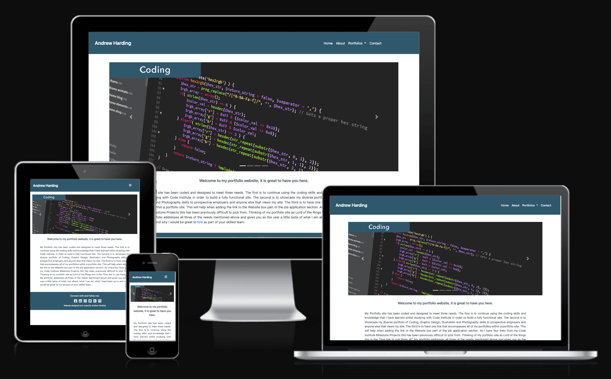

# Andrew Harding's Portfolio

My Portfolio site showcases my Coding, Graphic Design and Developer skills to potential employers. This also gives me a site to house all of my work as some jobs that I have applied for ask for only one link, which is a bit problematic when I have four links. This site addresses and solves this problem. Also I can show off my Graphic Design skills which I will be able to bring to and use in my new role.

## Showcase

A deployed live version of my Portfolio website can be found [here](andrewharding-portfolio.co.uk)

This domain link will allow you to access my live deployed website for my Portfolio. I have created this as part of my job search in order to showcase to employers my skills, as well as to continue coding and keep my new studied skills fresh, problem solve and learn from the challenges along the way to help make me a better Developer. 

My Portfolio site has been designed to be responsive across all platforms. The original designs kept this factor in mind and also encompasses the simple, clean, appealing and effective look and feel. I used my very colourful CV as the influence in colour choice that has been used and to tie this together with my CV creating continuity across my self brand. This is a skill that would be applied in any area of design and also showcases further still the Graphic Design traits that I have many years experience both study and working in.

## Table of Contents
1. [User Experience UX](#user-experience-ux)
    * [User Stories](#user-stories)
    * [As a new / first time user](#new-first-time-user)
    * [Returning Visitor Goals](#returning-visitor-goals)
    * [Frequent User Goals](#frequent-user-goals)
    * [User Customer Goals](#user-goals)
    * [Business Goals](#business-goals)
2. [Construction Planes](#construction-planes)
    * [Strategy](#strategy)
    * [Scope](#scope)
    * [Structure](#structure)
    * [Skeleton](#skeleton)
    * [Surface](#surface)
3. [Design](#design)
    * [Wireframes](#wireframes)
    * [Imagery](#imagery)
4. [Features](#features)
    * [Existing-features](#existing-features)
    * [Future-features](#future-features)
5. [Technologies and Languages Used](#technologies)
    * [Libraries Frameworks and Online Resources Used](#libraries)
    * [Tools](#tools)
    * [Programmes](#programmes)
    * [Other Resources](#other-resources)
    * [Social Media](#social-media)
6. [Testing](#testing)
    * [Implementation](#implementation)
    * [Results](#results)
    * [Bugs](#bugs)
7. [Deployment](#deployment)
8. [Credits](#credits)
    * [Content](#content)
    * [Media](#media)
    * [Acknowledgments](#acknowledgments)