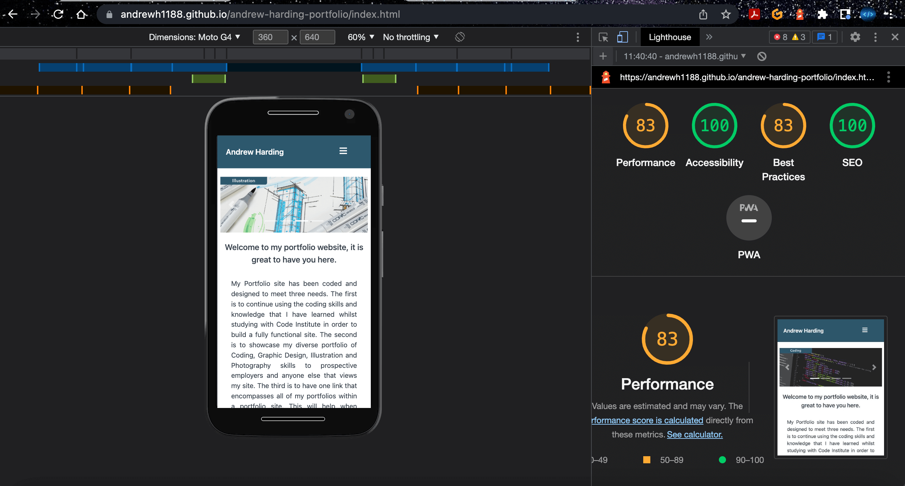
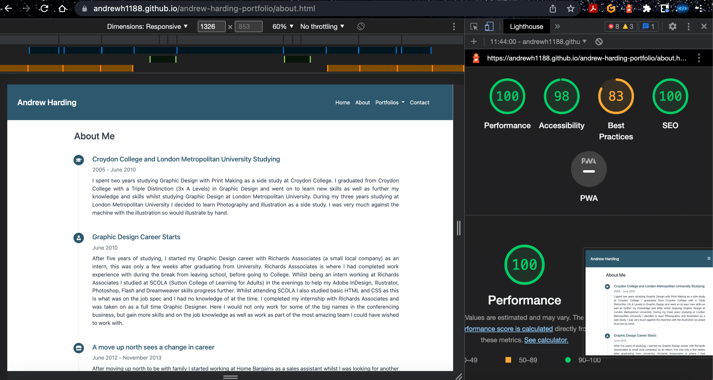
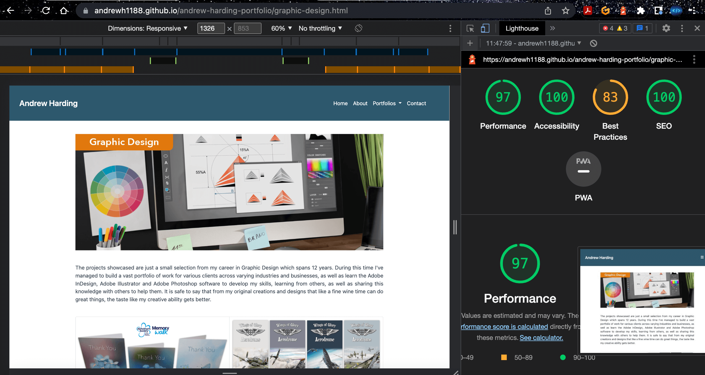

Back to [README.md](README.md) file

## Testing

## Table of Contents
1. [Navigation](#navigation)   
2. [Testing User Stories](#testing-user-stories)
3. [Implementation](#implementation)
4. [Devices used](#devices-used)
5. [Browsers](#browsers)
6. [Lighthouse Results](#lighthouse-results)
7. [Validators](#validators)
	* [HTML Validator](#html-validator)
	* [Jigsaw CSS Validator](#jigsaw-css-validator)
	* [JSHint](#jshint)

### Navigation

### User Stories

### Implementation

### Devices Used
The following devices were used to test this site on:

* iPhone 13
* 13 inch MacBook Pro
* iPad (5th generation)

### Browsers
The following Browsers were used to test this site:

* Google Chrome
* Safari

## Lighthouse Results
I have tested my site using Lighthouse in Google Chrome Dev Tools and my results for the testing of the various pages are as follows:

### Home Page Desktop Results:

### Home Page Mobile Results:

### About Page Desktop Results:

### About Page Mobile Results:

### Coding Page Desktop Results:

### Coding Page Mobile Results:

### Graphic Design Page Desktop Results:

### Graphic Design Page Mobile Results:

### Illustration Page Desktop Results:

### Illustration Page Mobile Results:

### Photography Page Desktop Results:

### Photography Page Mobile Results:

### Contact Page Desktop Results:

### Contact Page Mobile Results:

### Validators
### HTML Validator
When I originally ran my code through the W3C HTML validator I had some issues. the issues highlighted to me were:

1. Unclosed div in the nav section.
2. Unclosed section tag in the footer.
3. Script tags outside of the body.

After I'd corrected these mistakes and ran this through the W3C HTML validator I was only left with 3 warnings. These warnings relate to the EmailJS code that I took from EmailJS itself. I looked at amending this so that the W3C validator would be ok with the code that it saw. I tested the form with the type="script/javascript" removed but the form didn't work, so I have had to leave this in.

### Home

### About

### Coding

### Graphic Design

### Illustration

### Photography

### Contact

### Jigsaw CSS Validator
When I first tested my CSS I had two warnings that I had done. There are other warnings but these are coming from Bootstrap.

After removing the depreciated media feature the validator showed no errors that I had done.

#### JSHint
When I tested the JavaScript Code through JSHint I had the following results:

### Drop-down Menu

After running the JavaScript code through JSHint I saw that I needed the semicolon at the end to the line.

After adding the semicolon at the end and re running the validator this outcome was ok.

### Carousel

After running the JavaScript code through JSHint I saw that I needed the semicolon at the end to the line.

After adding the semicolon at the end and re running the validator this outcome was ok.

### Contact Us

### Back to top button

[Back to Table of Contents](#table-of-contents)