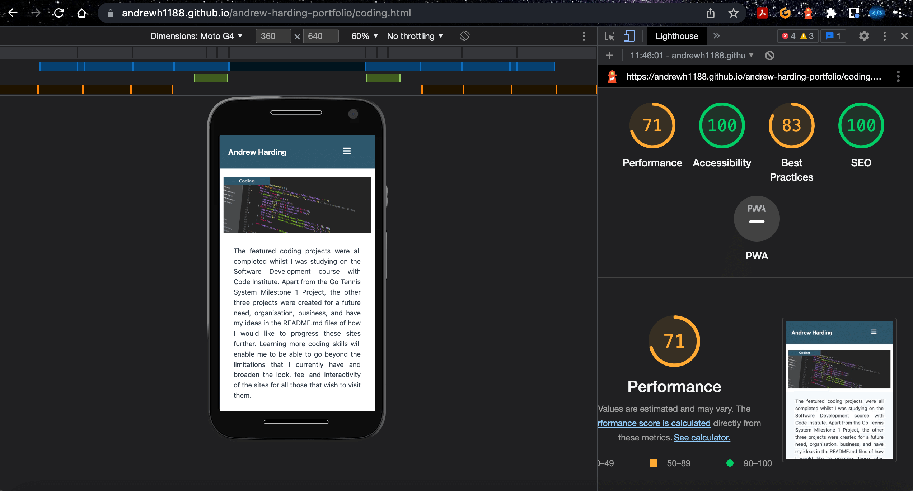
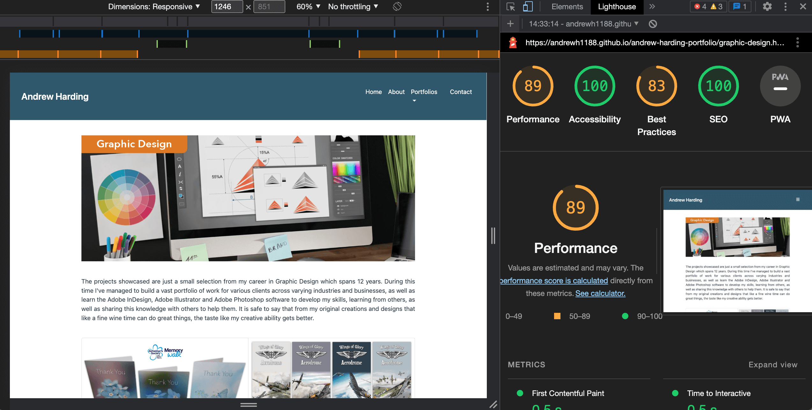
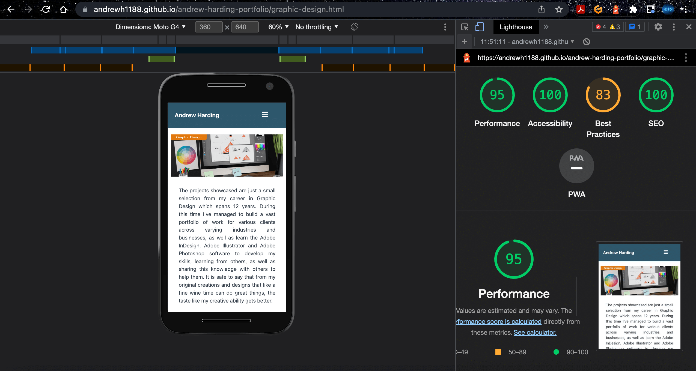

Back to [README.md](README.md) file

## Testing

## Table of Contents
1. [Navigation](#navigation)
2. [Home](#home) 
3. [About](#about)
4. [Coding](#coding)
5. [Contact](#contact)  
6. [Testing User Stories](#testing-user-stories)
7. [Implementation](#implementation)
8. [Devices used](#devices-used)
9. [Browsers](#browsers)
10. [Lighthouse Results](#lighthouse-results)
11. [Validators](#validators)
	* [HTML Validator](#html-validator)
	* [Jigsaw CSS Validator](#jigsaw-css-validator)
	* [JSHint](#jshint)

### Navigation
* Tested navigation in nav bar takes users to the clicked page.
* Tested when page clicked that an underline appears to show the user which page they are on. The dropdown works slightly different to the main menu, but this still shows the user which page they are on.
* Tested Social Media icons link to the right sites and my account.

### Home
* Tested the carousel links to the right pages when the image is clicked on.
* Tested carousel can be manually controlled by clicking the left and right arrows.
* Tested carousel can be manually controlled using the bars on the carousel.
* Tested the word hire takes the user to the contact page.

### About
* Tested links in the about text section take the user to the right page.

### Coding
* Tested links in the coding text section take the user to the right page.

### Contact
* Tested forms can't be left blank when submit button is pressed.
* Tested completed form delivers to my email account with the correct details as per those filled out in the form.

### User Stories

### Implementation
My Portfolio site has been coded and designed to meet three needs. 
1. The first is to continue using the coding skills and knowledge that I have learned whilst studying with Code Institute in order to build a fully functional site. 
2. The second is to showcase my diverse portfolio of Coding, Graphic Design, Illustration and Photography skills to prospective employers and anyone else that views my site. 
3. The third is to have one link that encompasses all of my portfolios within a portfolio site. This will help when adding the link to the Website box part of the job application section. As I have four links from my Code Institute Milestone Projects this has been previously difficult to pick from. Thinking of my portfolio site as Lord of the Rings this is the “One link to rule them all”. My portfolio addresses all three of the needs mentioned above and gives you as the user a little taste of what I am about, what I can do, what I have been up to.

### Devices Used
The following devices were used to test this site on:

* iPhone 13
* 13 inch MacBook Pro
* iPad (5th generation)

### Browsers
The following Browsers were used to test this site:

* Google Chrome
* Safari

## Lighthouse Results
I have tested my site using Lighthouse in Google Chrome Dev Tools and my results for the testing of the various pages are as follows:

### Home Page Desktop Results:

Second test after amends to code

### Home Page Mobile Results:

Second test after amends to code

### About Page Desktop Results:

Second test after amends to code

### About Page Mobile Results:

Second test after amends to code

### Coding Page Desktop Results:

Second test after amends to code

### Coding Page Mobile Results:

Second test after amends to code

### Graphic Design Page Desktop Results:

Second test after amends to code

### Graphic Design Page Mobile Results:

Second test after amends to code

### Illustration Page Desktop Results:

Second test after amends to code

### Illustration Page Mobile Results:

Second test after amends to code

### Photography Page Desktop Results:

Second test after amends to code

### Photography Page Mobile Results:

Second test after amends to code

### Contact Page Desktop Results:

Second test after amends to code

### Contact Page Mobile Results:

Second test after amends to code

With all the second tests that I conducted (after amending the code because of the validator suggestions and tips) I noticed that whilst some results stay the same and others improve. There are other results that haven't and have gone down. I had to run the second Lighthouse testing in incognito mode as there were issues affecting this. This is the only reason that I could put the negative change in results down to. 

### Validators
### HTML Validator
When I originally ran my code through the W3C HTML validator I had some issues. the issues highlighted to me were:

1. Unclosed div in the nav section.
2. Unclosed section tag in the footer.
3. Script tags outside of the body.

After I'd corrected these mistakes and ran this through the W3C HTML validator I was only left with 3 warnings. These warnings relate to the EmailJS code that I took from EmailJS itself. I looked at amending this so that the W3C validator would be ok with the code that it saw. I tested the form with the type="script/javascript" removed but the form didn't work, so I have had to leave this in.

### Home

### About

### Coding

### Graphic Design

### Illustration

### Photography

### Contact

### Jigsaw CSS Validator
When I first tested my CSS I had two warnings that I had done. There are other warnings but these are coming from Bootstrap.

After removing the depreciated media feature the validator showed no errors that I had done.

#### JSHint
When I tested the JavaScript Code through JSHint I had the following results:

### Drop-down Menu

After running the JavaScript code through JSHint I saw that I needed the semicolon at the end to the line.

After adding the semicolon at the end and re running the validator this outcome was ok.

### Carousel

After running the JavaScript code through JSHint I saw that I needed the semicolon at the end to the line.

After adding the semicolon at the end and re running the validator this outcome was ok.

### Contact Us

### Back to top button

[Back to Table of Contents](#table-of-contents)